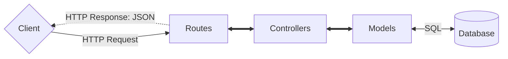
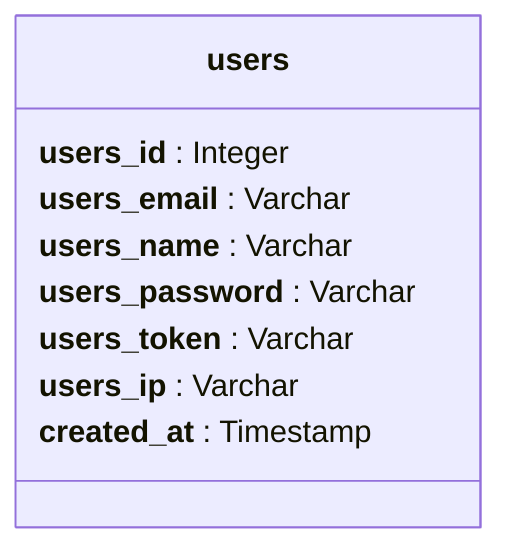

# FlorAccess

# Table des matières

Expand contents

- [FlorAccess](#floraccess)
- [Table des matières](#table-des-matières)
- [Présentation](#présentation)
- [Fonctionnalités](#fonctionnalités)
- [Architecture de l'application](#architecture-de-lapplication)
- [Architecture de la base de données](#architecture-de-la-base-de-données)
  - [Modèle Conceptuel de Données (MCD)](#modèle-conceptuel-de-données-mcd)
  - [Modèle Logique de Données (MLD)](#modèle-logique-de-données-mld)
- [Routes available](#routes-available)
- [Technologies utilisées](#technologies-utilisées)
- [Installation](#installation)
- [Auteur](#auteur)
- [Report de bug et suggestions](#report-de-bug-et-suggestions)
- [License](#license)

# Présentation

FlorAccess est une API d'authentification et de gestion des utilisateurs. Elle permet d'enregistrer les utilisateurs, et données l'accès à n'importe quelle application qui accepte les JWT génération par FlorAccess.

# Fonctionnalités

- [x] Enregistrement des utilisateurs
- [x] Connexion via JWT
- [x] Vérification de l'existence d'un utilisateur
- [x] Envoi d'e-mails de connexion
- [ ] Connexion via mot de passe
- [ ] Réinitialisation de mot de passe

# Architecture de l'application

# Architecture de la base de données

## Modèle Conceptuel de Données (MCD)

## Modèle Logique de Données (MLD)

- **users** (<u>users_id</u>, users_email, users_name, users_password, users_token, users_ip, created_at)

# Routes available

**For full documentation please see [https://domaine.name/api-docs](#routes-available) or read '`/docs/swagger.json`' in [Swagger editor](https://editor.swagger.io/)**

| Action | Méthode | Route | Type de données retournée | Description |
|:------:|:-------:|:------|:--------------------------|:------------|
| Select | GET     | / | JSON |  |
| Create | POST    | / | JSON |  |
| Update | PUT     | / | JSON |  |
| Delete | DELETE  | / | JSON |  |

# Technologies utilisées

FlorAccess est une application web développée avec les technologies suivantes :

- Langages :
  - [JavaScript (TypeScript)](https://developer.mozilla.org/fr/docs/Web/JavaScript)
  - [*HTML*](https://developer.mozilla.org/fr/docs/Web/HTML)
  - [*CSS*](https://developer.mozilla.org/fr/docs/Web/CSS)
- Frameworks et librairies :
  - [ExpressJS](https://www.npmjs.com/package/express)
  - [Express rate limiter](https://www.npmjs.com/package/express-rate-limit)
  - [Dotenv](https://www.npmjs.com/package/dotenv)
  - [Json web token](https://www.npmjs.com/package/jsonwebtoken)
  - [Node mailer](https://www.npmjs.com/package/nodemailer)
  - [Node postgres](https://www.npmjs.com/package/pg)
  - [Swagger UI Express](https://www.npmjs.com/package/swagger-ui-express)
- Base de données :
  - [PostgreSQL](https://www.postgresql.org/)
- Deployement :
  - [Docker](https://www.docker.com/)

# Installation

coming soon...

# Auteur

FlorAccess est un projet open-source développé uniquement par [Floris Robart](https://florobart.github.io/)

# Report de bug et suggestions

Si vous découvrez une erreur, quelquelle soit, cela peut êgre une faute de frappe ou d'orthographe, une erreur de calcul, une erreur de conception, un bug qui empêche le bon fonctionnement de l'application, ou tout autre problème, Merci de me le signaler par email à l'adresse [florobart.github@gmail.com](mailto:florobart.github@gmail.com). Toutes les erreurs, quelque soit leur nature ou leur importance, seront traitées le plus rapidement possible.

Si vous avez une une **suggestion**, une **idée**, une **amélioration**, ou une **demande de fonctionnalité**, merci de me la communiquer par email à l'adresse [florobart.github@gmail.com](mailto:florobart.github@gmail.com). Toutes les suggestions, quelque soit leur nature ou leur importance, seront étudiées et prises en compte dans la mesure du possible.

# License

FlorAccess est un projet open-source sous licence [GNU General Public License v3.0](https://opensource.org/licenses/GPL-3.0).
