# FlorAccess

## Table des matières

- [FlorAccess](#floraccess)
  - [Table des matières](#table-des-matières)
  - [Présentation](#présentation)
  - [Fonctionnalités](#fonctionnalités)
  - [Images](#images)
    - [Format mobile](#format-mobile)
    - [Format ordinateur](#format-ordinateur)
  - [Technologies utilisées](#technologies-utilisées)
  - [Installation](#installation)
    - [Prérequis](#prérequis)
    - [Installation de FlorAccess](#installation-de-floraccess)
  - [Autheur](#autheur)
  - [Report de bug et suggestions](#report-de-bug-et-suggestions)
  - [License](#license)

## Présentation

**FlorAccess** est une application web de gestion de comptes personnels. Elle a créé pour servir d'entrée à votre serveur personnel. C'est-à-dire que c'est cette application qui va gérer les comptes utilisateurs et qui affichera toutes les autres applications disponibles sur votre serveur personnel. Par exemple, j'ai créé une [application de gestion des finances](https://github.com/FloRobart/Econoris) et un [un gestionnaire de mot de passe](https://github.com/FloRobart/Lys_secure) qui se rattache à **FlorAccess**.

**FlorAccess** a été conçue pour être utilisé par plusieurs personnes, c'est pourquoi elle permet de créer plusieurs comptes utilisateurs. Chaque utilisateur aura donc son propre profil et ne pourra pas accéder à celui des autres sans leur mot de passe. Si vous êtes seul à utiliser l'application et que vous ne voulez pas créer de compte utilisateur ce ne sera pas possible, mais je vous invite créer un fork du projet et de modifier le code pour qu'il corresponde à vos besoins.

**FlorAccess** n'est pas disponible en ligne, si vous voulez l'utiliser, vous devrez l'installer sur votre propre serveur. Si vous voulez créer un serveur personnel, je vous recommande ce [tuto de Grafikart.fr](https://www.youtube.com/watch?v=cfJh8vdKuQU&list=PLjwdMgw5TTLUnvhOKLcpCG8ORQsfE7uB4). Si vous avez déjà un serveur personnel, vous pouvez suivre les [instructions d'installation de FlorAccess](#installation).

## Fonctionnalités

**Grâce à cette application, vous pourrez :**

- Créer un compte utilisateur avec un nom d'utilisateur, un mot de passe, une adresse email et une image de profil.
- Se connecter à un compte utilisateur avec un mot de passe seulement.
- Le système de connexion est basé sur le modèle de connexion de Netflix, c'est-à-dire que tout les comptes sont affichés à l'écran et qu'il suffit de cliquer sur le compte pour lequel on veut se connecter pour afficher le formulaire de mot de passe.
- Afficher la liste des comptes utilisateurs.
- Se déconnecter d'un compte utilisateur.
- Réinitialiser le mot de passe d'un compte utilisateur.
- Modifier les informations d'un compte utilisateur. (Nom d'utilisateur, adresse email, mot de passe et image de profil)
- Supprimer un compte utilisateur.
- Afficher le profil de l'utilisateur connecté.
- Afficher la page d'accueil de l'application qui regroupe les liens vers les autres applications de votre serveur personnel.
- Modifier les liens (lien et nom) des applications présentes sur la page d'accueil.
- Ajouter un lien d'une application sur la page d'accueil.
- Supprimer un lien d'une application sur la page d'accueil.

**FlorAccess** est une application web open source, elle est donc gratuite et libre d'utilisation. Vous pouvez l'utiliser, la modifier, la distribuer et la partager gratuitement. Par contre, vous ne pouvez ni la vendre, ni la commercialiser, ni la distribuer sans en donner l'accès gratuit, conformément à ce qui est noté dans [la licence](#license).

## Images

### Format mobile

<div style="display: flex; justify-content: space-between;">
  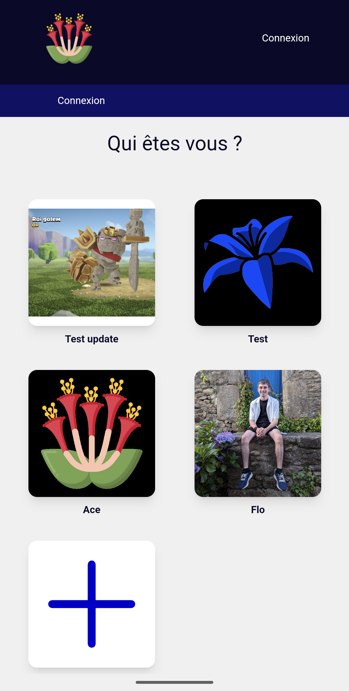
  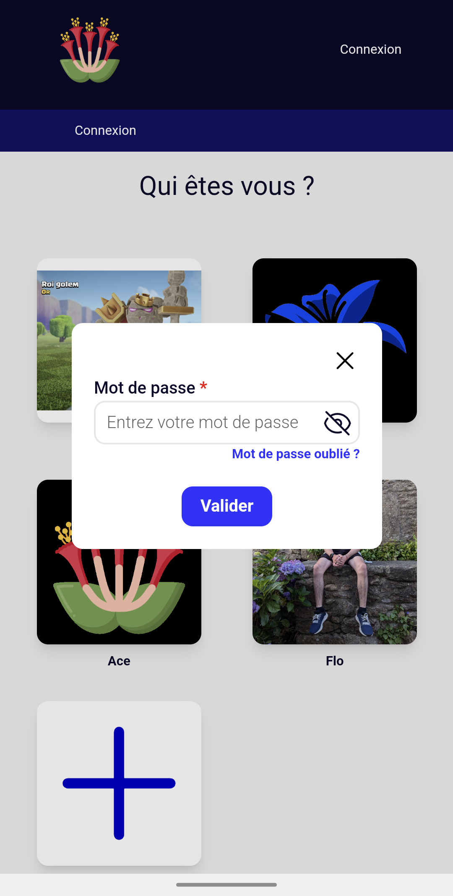
</div>

<div style="display: flex; justify-content: space-between; margin-top: 10px;">
  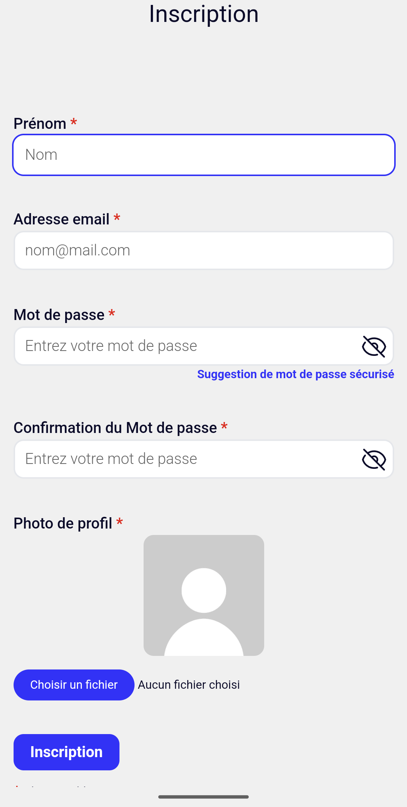
  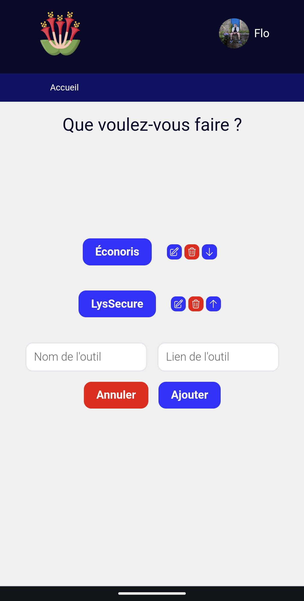
</div>

<div style="display: flex; justify-content: space-between; margin-top: 10px;">
  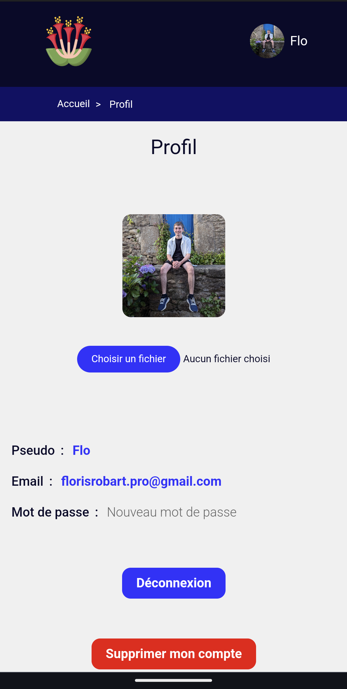
</div>

### Format ordinateur

<div style="display: flex; justify-content: space-between;">
  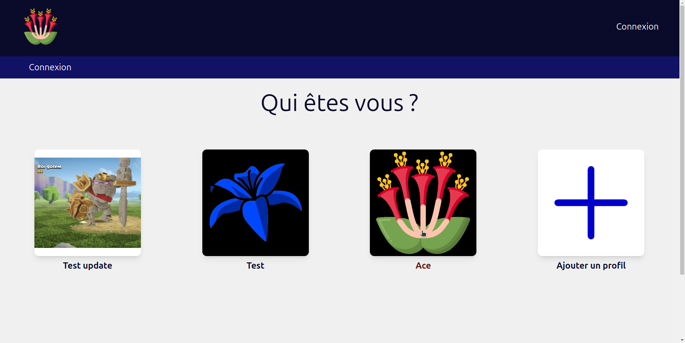
  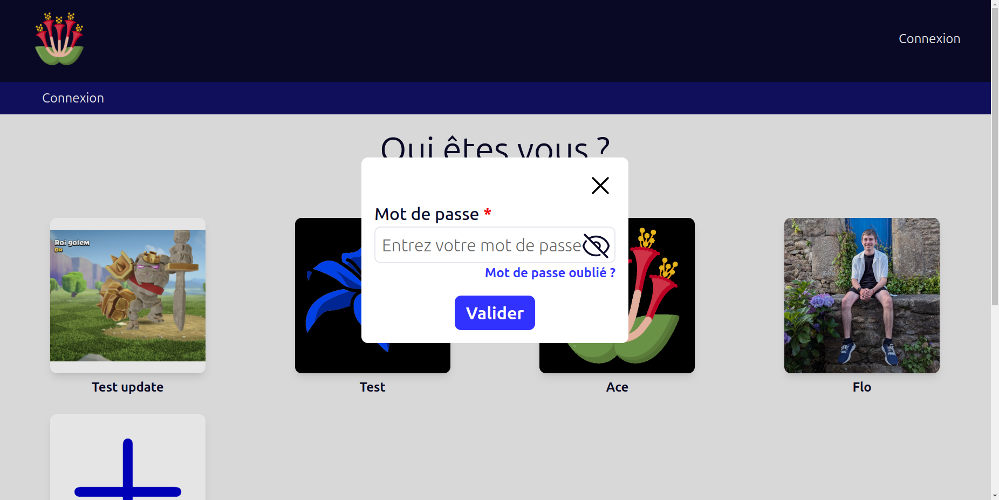
</div>

<div style="display: flex; justify-content: space-between; margin-top: 10px;">
  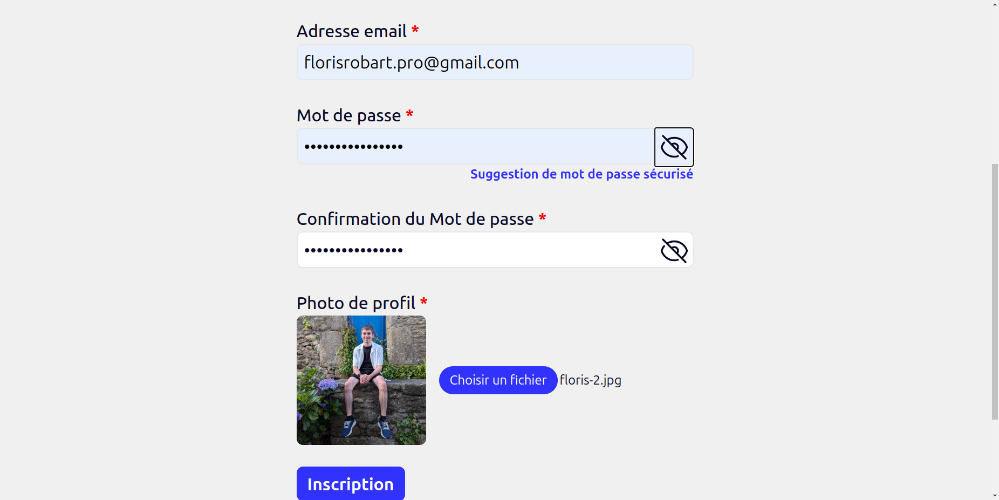
  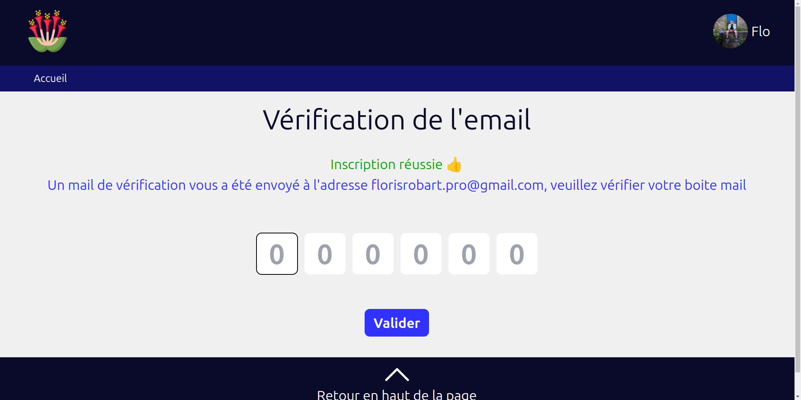
</div>

<div style="display: flex; justify-content: space-between; margin-top: 10px;">
  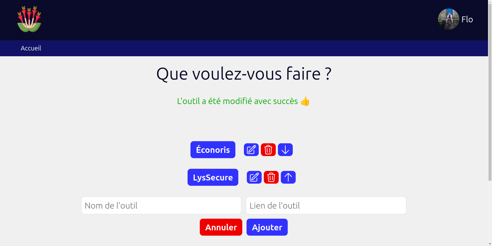
  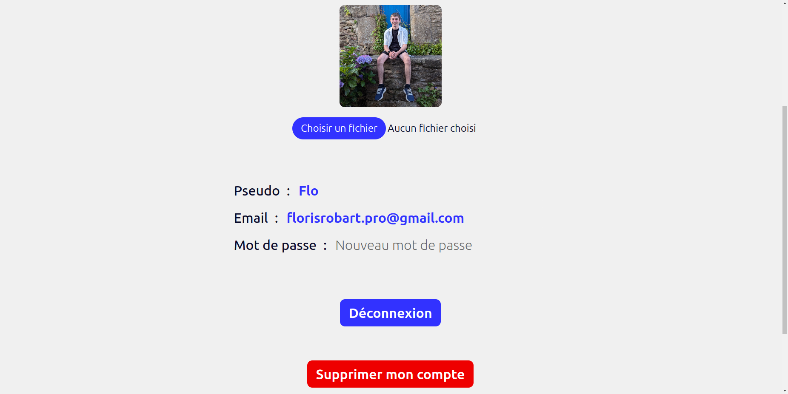
</div>

## Technologies utilisées

**FlorAccess** est une application web développée avec les technologies suivantes :

- **Langages :**
  - PHP
  - MySQL
  - JavaScript
  - *HTML*
  - *CSS*
- **Frameworks et librairies :**
  - Laravel
  - Tailwind CSS

## Installation

### Prérequis

Pour installer **FlorAccess** sur votre serveur, vous devez avoir les prérequis suivants :

- [Un serveur sous Linux de préférence](https://florobart.github.io/Documentations/src/doc_creation_serveur_local.html)
  - Vous pouvez également l'installer sur un ordinateur de bureau ou un hébergement web sous Linux, Windows ou MacOS, mais vous devrez adapter vous-même les instructions d'installation.
- [PHP 8.x](https://florobart.github.io/Documentations/src/doc_developpement_web.html#php)
- [Composer](https://florobart.github.io/Documentations/src/doc_developpement_web.html#composer)
- [Node.js](https://florobart.github.io/Documentations/src/doc_developpement_web.html#installation-de-nodejs---linux)
- [NPM](https://florobart.github.io/Documentations/src/doc_developpement_web.html#installation-de-npm---linux)
- [XAMPP](https://florobart.github.io/Documentations/src/doc_developpement_web.html#xampp)
  - Vous pouvez également utiliser un autre serveur web, mais vous devrez adapter vous-même les instructions d'installation.
  - Vous pouvez aussi [installer Apache](https://florobart.github.io/Documentations/src/doc_developpement_web.html#apache) et [MySQL](https://florobart.github.io/Documentations/src/doc_developpement_web.html#mysql) séparément, mais XAMPP vous facilitera grandement l'installation et la configuration de ces deux logiciels.

### Installation de FlorAccess

- Clonez le dépôt de **FlorAccess**

  ```bash
  git clone git@github.com:FloRobart/FlorAccess.git
  ```

- Copier le fichier `.env.example` dans le fichier `.env`
- Ajouter les données nécessaire au bon fonctionnement de **FlorAccess** dans le fichier `.env` en suivant les instructions et commentaires du fichier `.env.example`
- Intaller les dépendances

  ```bash
  composer install
  npm install
  ```

- Créer les base de données

  ```bash
  php artisan migrate --database=floraccess
  ```

- Compiler les assets

  ```bash
  npm run build
  ```

- Votre application est prête à être utilisée. Démarrez votre base de données et votre serveur web et rendez-vous sur votre navigateur à l'adresse de votre serveur pour accéder à **FlorAccess**.

## Autheur

**FlorAccess** est un projet open-source développé par [Floris Robart](https://florobart.github.io/)

## Report de bug et suggestions

Si vous découvrez une erreur, quelqu'elle soit, cela peut être une faute de frappe ou d'orthographe, une erreur de calcul, une erreur de conception, un bug qui empêche le bon fonctionnement de l'application, ou tout autre problème, merci de me le signaler par mail à l'adresse [florobart.github@gmail.com](mailto:florobart.github@gmail.com). Toutes les erreurs, quelle que soit leur nature ou leur importance, seront traitées le plus rapidement possible.

Si vous avez une **suggestion**, une **idée**, une **amélioration**, ou une **demande de fonctionnalité**, merci de me la communiquer par mail à l'adresse [florobart.github@gmail.com](mailto:florobart.github@gmail.com). Toutes les suggestions, quelle que soit leur nature ou leur importance, seront étudiées et prises en compte dans la mesure du possible.

## License

FlorAccess est un projet open-source sous licence [GNU General Public License v3.0](https://opensource.org/licenses/GPL-3.0).
